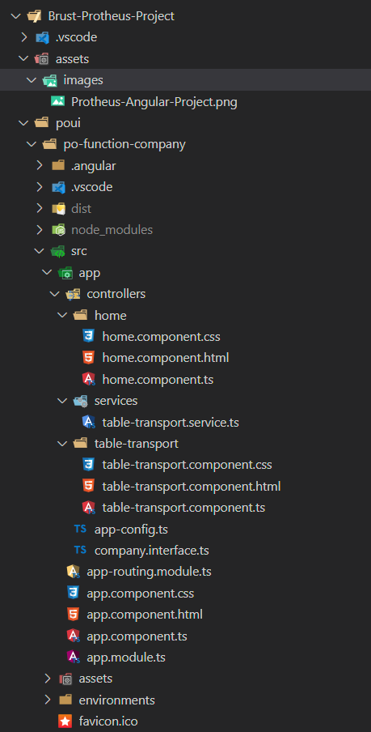

# Protheus-Project-TLPP-PO-UI

Repository for developing TL++ and POUI projects for the Totvs Protheus environment.

## 🛠️ Projeto em fase de construção 🛠️

### :bookmark: Tecnologias

O projeto é desenvolvido em:

-   [Front-end - Framework - Angular 16](https://angular.io/)

-   [Front-end - Biblioteca - PO UI v16.5](https://po-ui.io/)

-   [Back-end - ERP Protheus Release 12.1.2310](https://tdn.totvs.com/pages/releaseview.action?pageId=744479921)
-   [API Rest - TLPP](https://tdn.totvs.com/display/tec/TLPP)

### :books: Versões globais início do projeto

Angular CLI: 16.2.8
Node: 18.18.0
Package Manager: npm 9.8.1
OS: win32 x64

Angular: 16.2.11
... animations, common, compiler, compiler-cli, core, forms
... platform-browser, platform-browser-dynamic, router

### :package: Package Version

@angular-devkit/architect 0.1602.8
@angular-devkit/build-angular 16.2.8
@angular-devkit/core 16.2.8
@angular-devkit/schematics 16.2.8
@angular/cli 16.2.8
@schematics/angular 16.2.8
rxjs 7.5.7
typescript 5.1.6
zone.js 0.13.3

### :deciduous_tree: Estrutura de pastas sugerida para o projeto :



### 🎨 Layout

O layout da aplicação segue o padrão do PO UI Totvs Protheus

#### ⚙️ [ Instalando o PO UI ]

[Site Oficial PO UI - https://po-ui.io/guides/getting-started](https://po-ui.io/guides/getting-started)

1. Verificar versão do angular atual compativel com o POUI:

```bash
  npm update
```

2. Passos para instalação do PO UI:

```bash
  ng new po-proj-routine-company --skip-install
```

3. Verificar as dependencias do angular no arquivo package.json:

```bash
  npm version @angular/rxjs
  npm install rxjs@~7.5.5 --save
  npm list rxjs
```

4. Executar o comando na pasta raiz do projeto:

```bash
  npm install
```

5. Adiconando o pacote @po-ui/ng-components:

```bash
  ng add @po-ui/ng-components
```

6. Rode o seu projeto:

```bash
  ng serve
```

7. Instalando po-page-login, po-modal-password-recovery, po-page-blocked-user, po-page-dynamic-table:

```bash
  ng add @po-ui/ng-templates
```

8. Gerar a build do projeto - Será criada uma pasta chamada dist na raiz do projeto "build de produção" ou "build de release".:

```bash
  ng build --configuration=production
```

#### ⚙️ [ Atualizando o PO UI ]

1. Entrar na raiz do projeto e atualizar:

```bash
  ng update @po-ui/ng-components@15.9.2 --allow-dirty --force
```

2. Entrar na raiz do projeto e atualizar:

```bash
  ng update @po-ui/ng-templates@15.9.2 --allow-dirty --force
```

#### ⚙️ [ Criando no PO UI ]

1. para criar um novo componente. Entrar na pasta raiz do projeto(po-proj-function-company) :

```bash
  ng g c nome-componente
```

2. Ir no arquivo app.module.ts e importar o componente se necessário de acordo com a documentação do PO UI
   pegar no arquivo .ts do componente o conteudo da propriedade do selector para poder instanciar no html que será mostrado.
   Colocar na chamada do componente a class css padrão

3. Criar um serviço:
   navegar ate a pasta app

```bash
 ng generate service services/sample-po-service
```

#### ⚙️ [ Publicação no Protheus ]

- Criar a aplicação web.
- Gerar a build de produção da aplicação web.
- Compactar a pasta que a build gerou e renomear para que a extensão fique como .app .
- Compilar o arquivo compactado .app no RPO. Basta compilá-lo normalmente, ele será compilado como resource e ficará no RPO.
- Criar um fonte com uma função, que será a rotina de menu.
- Nesse fonte, você utilizará a função FWCallApp para chamar a aplicação gerada, sendo que o parâmetro principal da FWCallApp é exatamente o nome do arquivo .app que você compilou como resource no RPO (po-proj-function-company).

#### ⚙️ [ Atualizando a Rotina no Protheus ]

- Excluir rotina do rpo: po-proj-function-company.
- Apagar a pasta dist do projeto angular PO UI.
- Fazer as alterações no projeto e gerar novo build
- Zipar a pasta gerada na pasta dist
- Mudar a extensão de zip para app
- Copiar o arquivo po-proj-function-company.app para a pasta do protheus onde existe a function tlpp que chamará o app.
- Compilar no rpo do protheus os 2 arquivos.
- Apagar a pasta(po-proj-function-company) em \Protheus_Data\http-root\app-root
- Chamar rotina pelo protheus para gerar a pasta novamente

#### Licença

Este projeto está sob a licença MIT. Consulte o arquivo [LICENSE](./LICENSE) para obter mais detalhes.

--------------------------------------------------------------------------------------------------------------

ng new po-function-company --skip-install

Would you like to add Angular routing?(y)

Which stylesheet format would you like to use? (Use arrow keys)
> CSS 

Verificando dependências do PO UI

downgrade para "rxjs": "~7.5.5"

update para "typescript": "~5.1.6"

add package @po-ui/ng-components 

add package @po-ui/ng-templates

add module controllers
ng generate module controllers

add component dynamic table

definindo as rotas


